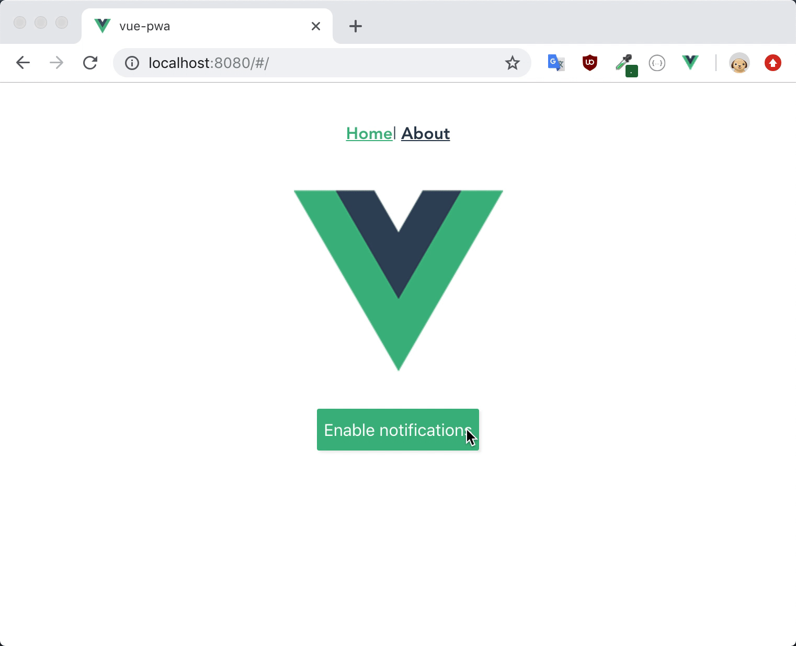

# vue-pwa

Following the guide here: https://www.blog.plint-sites.nl/progressive-web-app-using-vue-cli-3/<br>

Send a simple notification to user when they enable notifications by clicking a button.

Demo:
<br>



## Project setup
```
yarn install
```

### Compiles and hot-reloads for development
```
yarn run serve
```

### Compiles and minifies for production
```
yarn run build
```

### Compiles and hot-reloads for production
To test service worker, you have to run the production package. Use the following command to build production package, and serve it off http-server.
```
yarn run serve-build
```

## Continuous Delivery

Using Docker
```
docker build -t dockerize-vue-pwa .
docker run -it -p 8080:8080 --rm --name dockerize-vue-pwa-1 dockerize-vue-pwa
```

Using Netlify

[](https://app.netlify.com/sites/experiments-pulkit-01/deploys)

